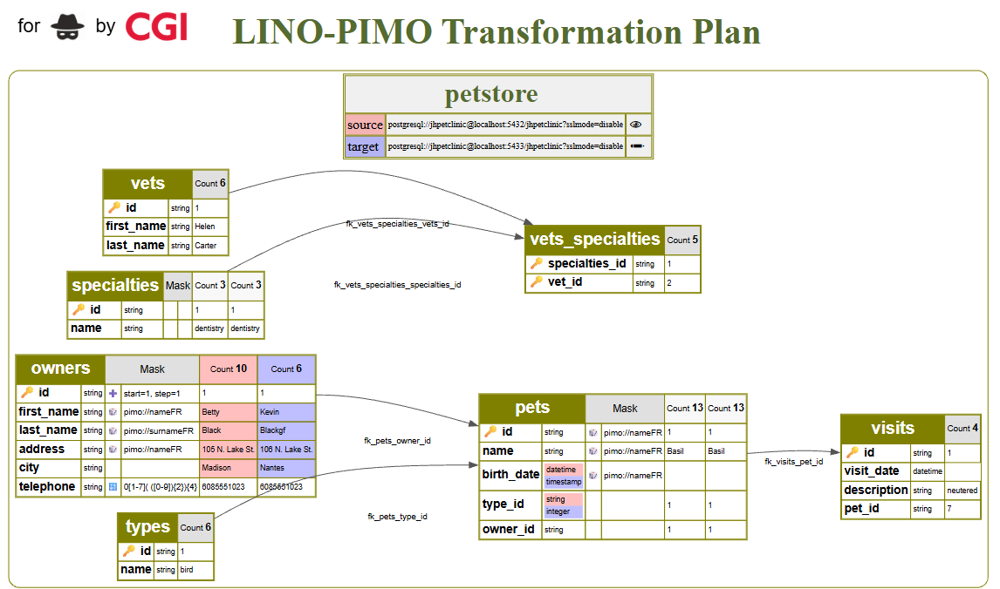

# NINO
NINO (Narrow Input, Narrow Output) is a dedicated workspace environement for data anonymisation, pseudonimisation. It includes a Lino-Pimo Transformation Plan viewer built on top of Graphviz, an interactive web UI, and a backend service.



# Description 

NINO parses YAML configuration files from specified project directories and generates interactive visualizations. When run in daemon mode (`-d`), it starts a web server (http://localhost:2442/nino by default) that provides a comprehensive view of your data transformation pipelines.

The interactive web interface allows users to explore the data schema, view data distribution plots for specific table columns, and visualize the execution plan of associated Ansible playbooks. Furthermore, it exposes a set of API endpoints for programmatic access, enabling integration with external tools for file management and automation. This makes it a powerful utility for both documenting and managing complex data transformation processes.

# API Routes

## Schema Visualization
*   `GET /api/schema.{format:(dot|svg|png)}`: Returns the project schema in the specified format (DOT, SVG, or PNG).
*   `GET /api/schema/{folder}.{format:(dot|svg|png)}`: Returns the schema for a specific folder in the specified format.
*   `GET /api/plot/{folder}/{tableName}`: Returns a PNG image plotting the data distribution for a table's columns.
*   `GET /api/playbook/{folder}`: Returns the DOT graph for an Ansible playbook execution plan.

## File Management

*   `GET /api/files`: Returns a JSON object listing all files within the project directories.
*   `GET /api/file/*`: Retrieves the raw content of a specific file. The `*` captures the full path to the file relative to the project root.
*   `POST /api/file/*`: Updates the content of a specific file with the request body. The `*` captures the full path to the file.
*   `DELETE /api/file/*`: Deletes a specific file. The `*` captures the full path to the file.

## Creation Endpoints
*   `GET /api/folder/*`: Creates a new folder recursively. The `*` captures the full path of the folder to create.
*   `GET /api/new/mask/{folderName}/{tableName}`: Creates a new boilerplate masking file for a table.
*   `GET /api/new/playbook/*`: Creates a new boilerplate playbook file. The `*` captures the full path to the playbook file.
*   `GET /api/new/dataconnector/*`: Creates a new boilerplate dataconnector file. The `*` captures the full path to the dataconnector file.
*   `GET /api/new/bash/*`: Creates a new boilerplate bash script file. The `*` captures the full path to the bash script file.

## Execution Endpoints
*   `POST /api/exec/pimo`: Executes the PIMO CLI tool. Expects a JSON body with `yaml` and `json` fields.
*   `POST /api/exec/playbook/{folder}/{filename}`: Executes a specific Ansible playbook.
*   `POST /api/exec/script`: Executes a given script. Expects the script content in the request body.
*   `GET /api/exec/lino/fetch/{folder}/{filename}`: Fetches a single row of data as an example for a masking file.
*   `POST /api/exec/pull/{folder}/{filename}`: Executes a pull command.

## Other
*   `POST /api/reload`: Reloads all schemas.

# Start 
using CLI:
```sh 
nino . -d .
```

using docker
```sh
docker pull 0blive/nino
docker run -p 2442:2442 0blive/nino

# to rebuild 
# go build . && docker build -t 0blive/nino .
# docker login -u 0blive 
# docker push 0blive/nino
```

developement mode
```sh
# as daemon
go run . -d . 

# or single execution   
go run . . 
#✅ Fichier schema.dot généré avec succès.
```

## Test

Cypress end to end
```sh
npx run cypress 

## edit / reframe for a demo video 
ffmpeg -i tests/cypress/videos/ui_spec.cy.js.mp4 -vf "crop=620:480:460:70" -c:a copy demo.mp4 -y
```

<video width="640" height="480" controls>
  <source src="pimo.mp4" type="video/mp4">
</video>

# Features

- Bback end (server + graph rendering) en go 
- Front end (html, css, js) light weight Single Page App
- Web Browser execution 
  - pimo (examples, *.masking.yaml)
  - lino (tables, relation, analyse)
  - ansible playbooks 
- lino & pimo editor with autocompletion
  - dataconnectors.yaml
  - masking.yaml
  - ingress-descriptor.yaml 
  - tables.yaml 
  - relations.yaml 
- Transformation plan (graphviz)
  - database schema
  - colored diff schema 
  - colored diff masked value 
- Execution plan (graphviz)
  - playbook ansible 
  - cron tasks  
  - transformation sequence  
- Tables statistics plots to help analyzing use cases 
- Workspace files creation, access and save 
- local storage workspace and UI settings 

# Licence

GNU GPLv3
